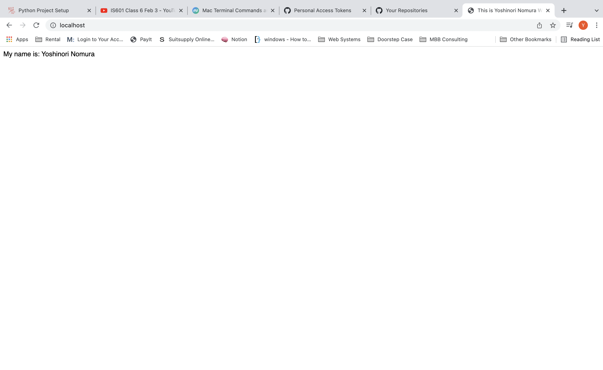

# Docker Nginx Flask Project Setup

Just Run: https://github.com/yn55/name_change.git

docker compose up --build to get it to run and go to locahost to see the site.

## Screenshot of Running Program

